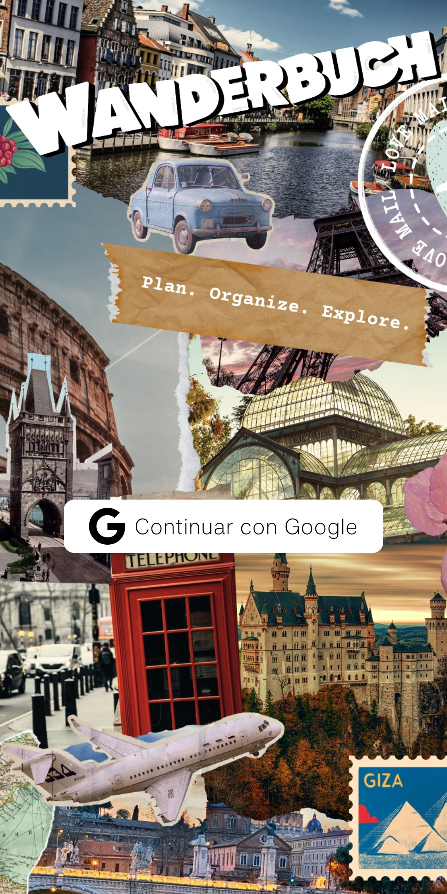

# 📱 WanderBuch ✈️🧳

**WanderBuch** is an Android application designed to simplify travel planning and organization by solving the problem of having to use multiple tools to manage itineraries, packing lists, documents, and notes. With a clean, modern, and intuitive interface, it centralizes all aspects of your trip in one single place.

## 🚀 Key Features

- ✍️ **Trip management:** Save and view your trips in an organized way.
- 📅 **Linked events:** Add events with dates and descriptions for each trip.
- 🧳 **Packing list:** Create and customize lists of items to bring.
- 📎 **Travel documents:** Attach important files (PDFs, images, etc.) related to your trip.
- 🗒️ **Quick notes:** Save ideas, recommendations, or useful thoughts.
- 🗺️ **Integrated maps:** Use maps to help you navigate while traveling.
- 🌍 **Built-in translator:** Communicate easily in different languages right from the app.

## 🎯 Purpose

WanderBuch aims to provide an **all-in-one solution** that centralizes the essential tools needed for smooth, efficient, and stress-free travel.

## 🛠️ Tech Stack

- 🧩 **Kotlin + Jetpack Compose** for a modern and responsive UI.
- ☁️ **Firebase** (Firestore & Storage) for cloud-based data and file storage.
- 🔄 **MVVM architecture** for clean and maintainable code structure.
- 🌐 **Translation and map APIs** for enhanced functionality without leaving the app.

## 📸 Screenshots

<table>
  <tr>
    <td align="center">
       
      <strong>Login screen</strong> 
      Sign in with Google to access personalized travel data.
    </td>
    <td align="center">
       
      <strong>Main screen</strong> 
      Overview of trips and quick access to core features via the floating action button.
    </td>
  </tr>
  <tr>
    <td align="center">
       
      <strong>Translator</strong> 
      Translate words or phrases to communicate easily in other languages.
    </td>
    <td align="center">
       
      <strong>Documents</strong> 
      Store and view important files like tickets, reservations, or IDs.
    </td>
  </tr>
  <tr>
    <td align="center">
       
      <strong>Packing list</strong> 
      Editable list to keep track of what you need to pack for each trip.
    </td>
    <td align="center">
       
      <strong>Trip notes</strong> 
      Add quick notes, ideas, or recommendations for each trip and keep everything organized.
    </td>
  </tr>
</table>
